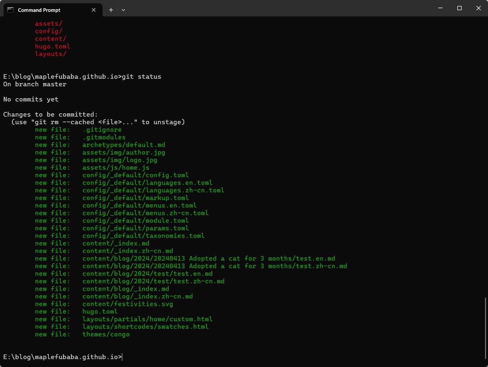
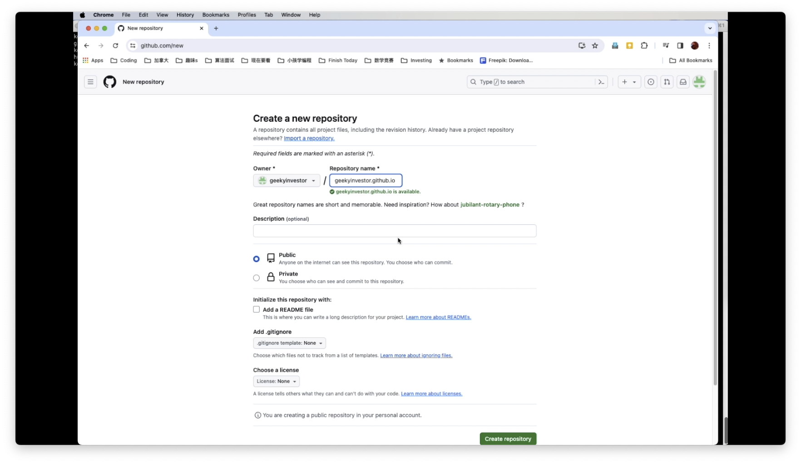
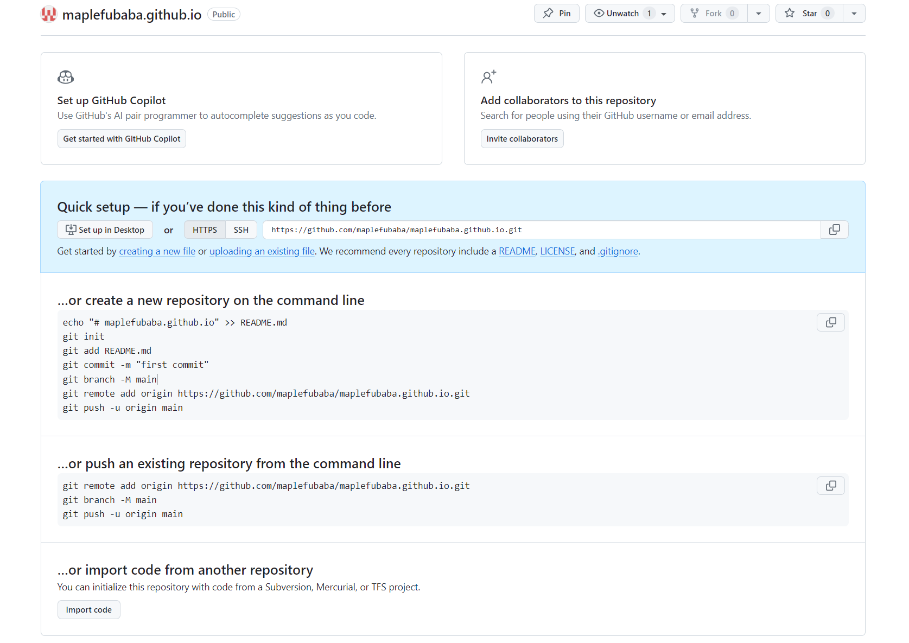
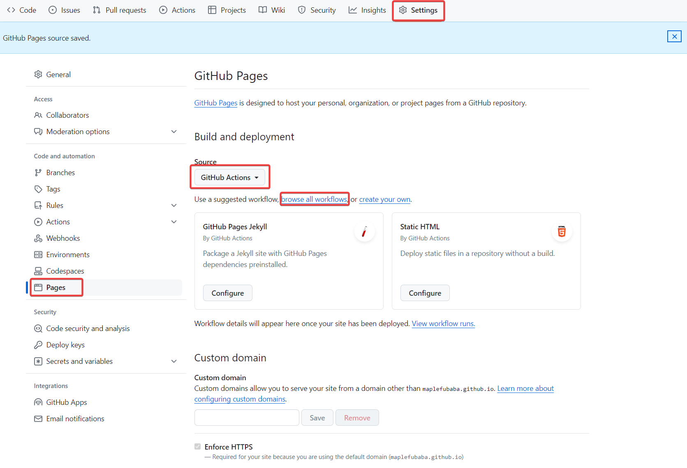
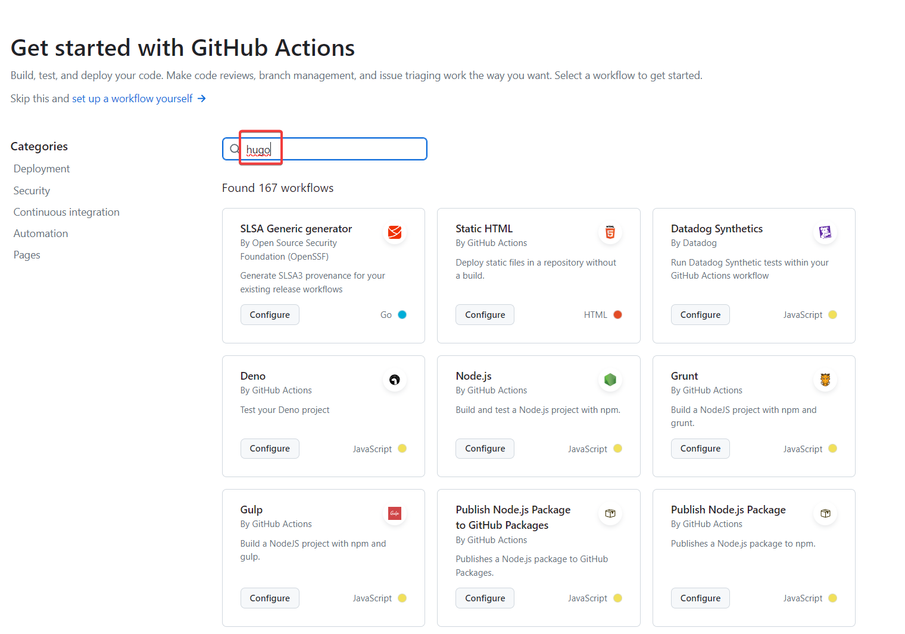
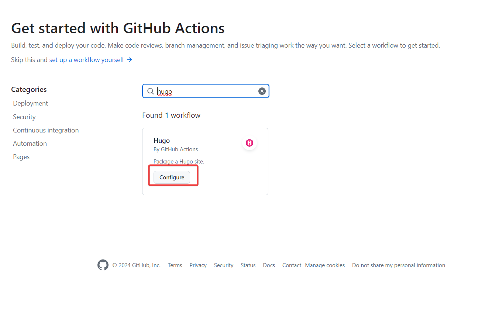
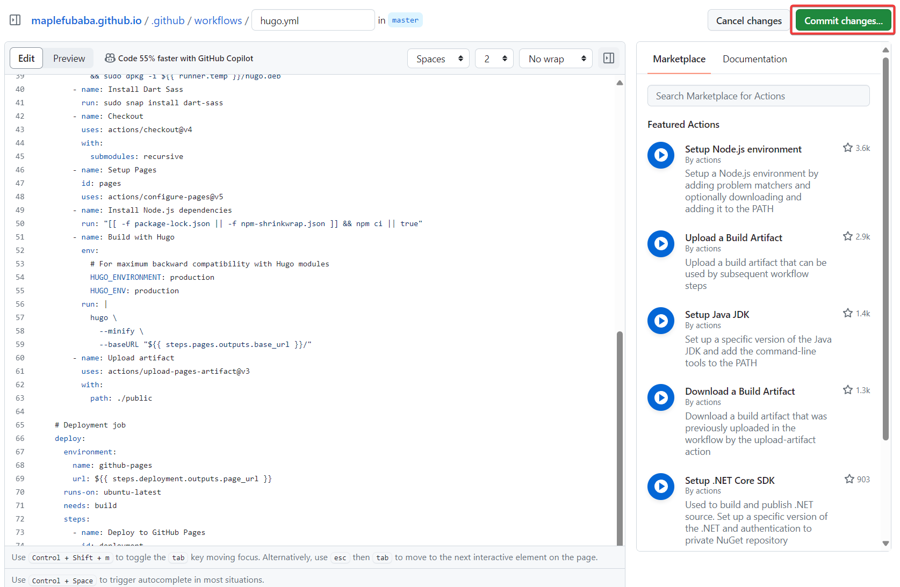
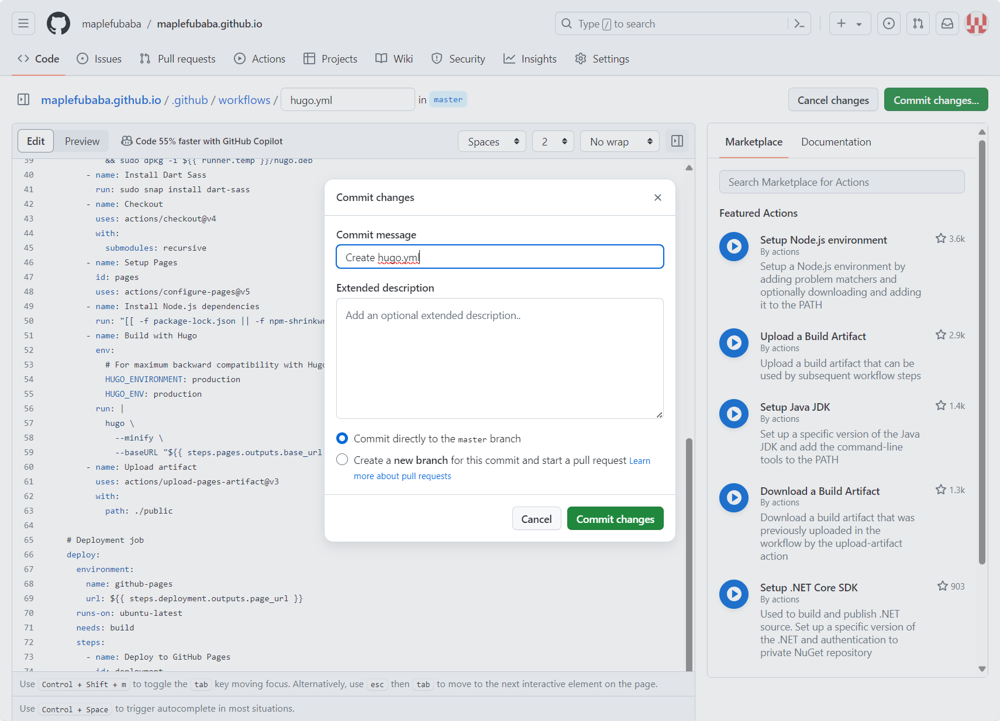
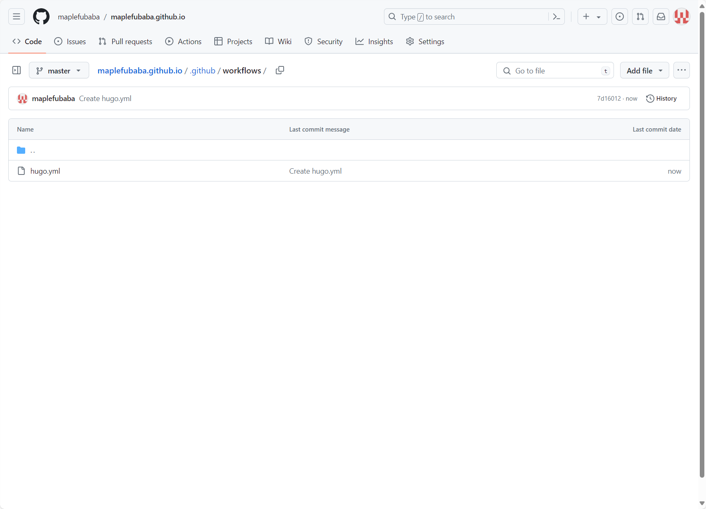
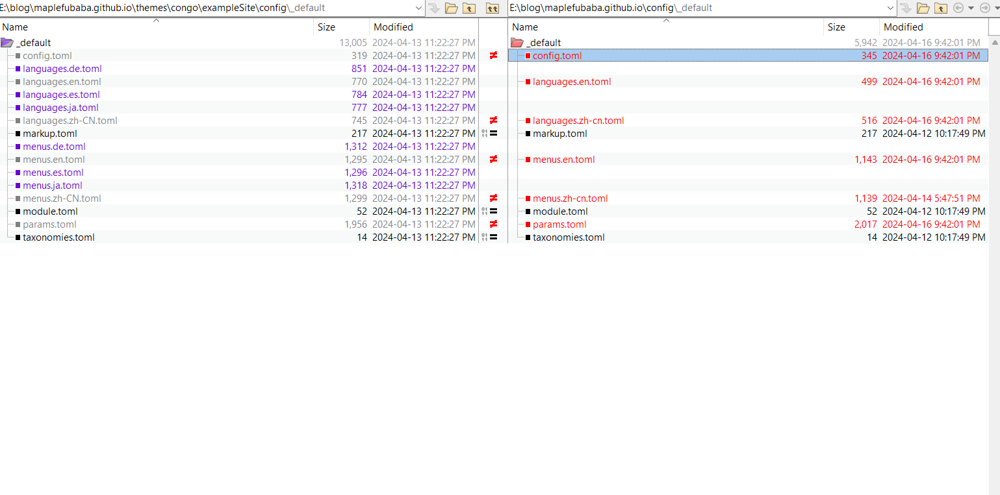

## 提前准备

没有一点html甚至markdown基础的技术小白还是推荐用wordpress，毕竟点几下鼠标就可以了，10分钟也能搞定。github pages是基于静态页面，后来管理是用jekyll或者hugo这样的命令行工具。懂技术的程序员，至少能用git，可能会更喜欢github pages这种完全自己控制的模式。

标题说是10分钟可以创建一个博客，那是对懂技术的人才适用的，有以下几个准备工作要提前做好。

- 需要在github上有一个账号，我们创建的博客用的是github的静态页面服务github pages。
- 需要对git有一个基本的了解，应该对程序员都不是问题，如果不是程序员就需要花点时间学习一下了，估计要几个小时了解一下概念和实践一下。
- 下载[hugo](https://gohugo.io)。hugo是一个可以动态生成和管理网页的命令行工具，它是用google出品的golang编写的，所以速度比类似工具jekyll快一个数量级。点[这里](https://github.com/gohugoio/hugo/releases/latest)下载最新的执行文件hugo_extended_xxxxxxxx_windows-amd64.zip，解压这个文件在windows下就得到hugo.exe。
- 在hugo的主题模板里选好一个主题theme。

hugo是一个命令行的工具，你可以把它下载以后在本地建立一个blog的目录，然后把hugo可执行文件hugo.exe拷到这个目录下运行就可以了。我是把hugo拷贝到一个我创建的命令行工具库目录下，然后在环境变量里把这个目录加到工作目录下，所以在命令行可以直接执行。

OK，假设现在你已经具备一下条件。
- 你在github上已经创建账户maplefubaba，github上空间网址www.github.com/maplefubaba。
- 选好一个hugo的主题congo。选择这个主题的原因是congo很简洁，而且直接支持多种语言。
- 

## 创建博客
你在E:\blog目录下。

```shell
hugo new site myblog.github.io
cd myblog.github.io
git init
git submodule add https://github.com/jpanther/congo themes/congo

```
然后修改在myblog.github.io目录下的hugo.toml文件，在里面加上一行指定主题
```
theme='congo'
```

### .gitignore文件
```
### Hugo ###
# Generated files by hugo
/public/
/resources/_gen/
/assets/jsconfig.json
hugo_stats.json

# Executable may be added to repository
hugo.exe
hugo.darwin
hugo.linux

# Temporary lock file while building
/.hugo_build.lock

```
到这一步可以用git status看看。


### 本地测试
执行
```
hugo server
```
在浏览器里面打开https://localhost:1313就可以访问了。

### commit&push到github
在github里创建代码库maplefubaba.github.io，这个名字的格式是固定的，以后也是可以直接访问的域名。



### github上的设置
接着可以设定github上的actions，相当于自动在github的服务器上运行hugo来生成网页并且把他们放到github pages里面。

下面是在github里面设置actions：

搜索hugo

设置hugo的action

保存commit


可以直接在github上看到在根目录下创建了.github/workflows/hugo.yml文件


## 直接访问域名
图片

## 开始

从themes/congo/exampleSite里面把文件拷贝到博客的根目录下，现在可以把content目录下的内容都删掉。博客的文章内容都是在content目录下，然后在content新建一个blog目录。

### 中英双语

congo主题支持多种语言，比如我希望网站同时支持中文（zh-cn）和英文（en），下面我们需要修改一些设置。

### 其他设置变更



config.tmol
```
# -- Site Configuration --
# Refer to the theme docs for more details about each of these parameters.
# https://jpanther.github.io/congo/docs/getting-started/

theme = "congo"
defaultContentLanguage = "zh-cn"	<- change default website language
hasCJKLanguage = true  				<- add this to fix wordcount and read time estimate

enableRobotsTXT = true
paginate = 15
summaryLength = 0

[outputs]
  home = ["HTML", "RSS", "JSON"]
```

params.toml
```
...
[homepage]
  #layout = "custom" # valid options: page, profile, custom
  layout = "profile" # valid options: page, profile, custom   <- I'd like to use profile
  showRecent = true
  recentLimit = 5
...

[article]
...
  showWordCount = true										  <- show word count 
...
```

languages.zh-cn.toml
```
languageCode = "zh-cn"
languageName = "简体中文"
languageDirection = "ltr"
weight = 1

title = "枫叶老付"
copyright = "&copy; 2024 枫叶老付"

[params]
  dateFormat = "2006年1月2日"

  mainSections = ["blog"]
  description = "博客"

[params.author]
  name = "老付"
  image = "img/author.jpg"
  headline = "欢迎来我的博客！"
  bio = "程序员/工程师/投资者/梦想家"
  links = [
    { youtube = "https://www.youtube.com/channel/UCBogzranpJg2nn42gUFFeIg" },
  ]
```

languages.en.toml
```
languageCode = "en"
languageName = "English"
languageDirection = "ltr"
weight = 2

title = "Maplefubaba"
copyright = "&copy; 2024 Kevin Fu"

[params]
  dateFormat = "2 January 2006"

  mainSections = ["blog"]
  description = "Blog"

[params.author]
  name = "Kevin Fu"
  image = "img/author.jpg"
  headline = "Welcome to my blog!"
  bio = "Sofware developer/Engineer/Investor/Dreamer"
  links = [
    { youtube = "https://www.youtube.com/channel/UCBogzranpJg2nn42gUFFeIg" },
  ]
```

menus.zh-cn.toml
```
# -- Main Menu --
# The main menu is displayed in the header at the top of the page.
# Acceptable parameters are name, pageRef, page, url, title, weight.
#
# The simplest menu configuration is to provide:
#   name = The name to be displayed for this menu link
#   pageRef = The identifier of the page or section to link to
#
# By default the menu is ordered alphabetically. This can be
# overridden by providing a weight value. The menu will then be
# ordered by weight from lowest to highest.

[[main]]
  name = "博客"
  pageRef = "blog"
  weight = 20

[[main]]
  name = "介绍"
  pageRef = "users"
  weight = 30
  [main.params]
    icon = "human3"
    showname = false

[[main]]
  name = "标签"
  pageRef = "tags"
  weight = 40
  [main.params]
    icon = "tag"

[[main]]
  identifier = "搜索"
  weight = 99
  [main.params]
    action = "search"

[[main]]
  identifier = "语言"
  weight = 100
  [main.params]
    action = "locale"

# -- Footer Menu --
# The footer menu is displayed at the bottom of the page, just before
# the copyright notice. Configure as per the main menu above.
```

menus.en.toml
```
# -- Main Menu --
# The main menu is displayed in the header at the top of the page.
# Acceptable parameters are name, pageRef, page, url, title, weight.
#
# The simplest menu configuration is to provide:
#   name = The name to be displayed for this menu link
#   pageRef = The identifier of the page or section to link to
#
# By default the menu is ordered alphabetically. This can be
# overridden by providing a weight value. The menu will then be
# ordered by weight from lowest to highest.

[[main]]
  name = "Blog"
  pageRef = "blog"
  weight = 20

[[main]]
  name = "About Me"
  pageRef = "users"
  weight = 30
  [main.params]
    icon = "human3"
    showname = false

[[main]]
  name = "Tags"
  pageRef = "tags"
  weight = 40
  [main.params]
    icon = "tag"

[[main]]
  identifier = "search"
  weight = 99
  [main.params]
    action = "search"

[[main]]
  identifier = "locale"
  weight = 100
  [main.params]
    action = "locale"

# -- Footer Menu --
# The footer menu is displayed at the bottom of the page, just before
# the copyright notice. Configure as per the main menu above.
```
### 创建第一篇博客文章

在blog下建立2024目录，然后再建”20240414 Create a blog on github in 10 mins“目录，这篇文章所有的文件都会存在这个目录下面。

新建index.zh-cn.md文件来写中文版本的文章，index.en.md文件是给英文版本的文章。

写好文章以后，可以在本地运行命令hugo server来显示效果。

[References]