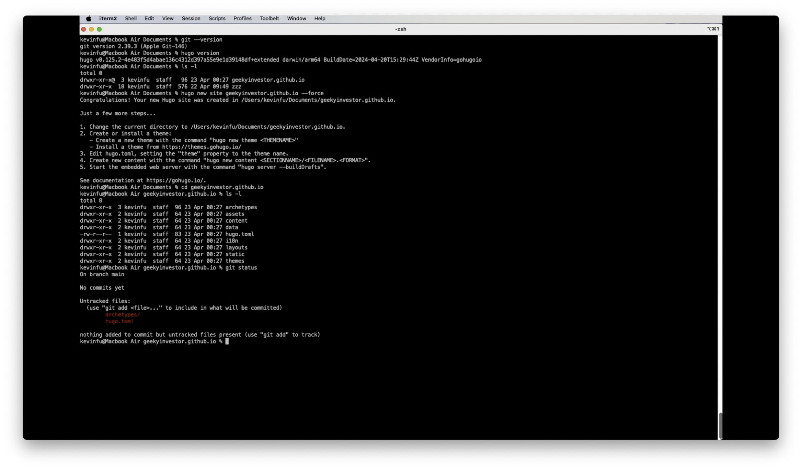

## 准备工作

创建免费博客或者DIY个人网站，没有一点html甚至markdown基础的技术小白还是推荐用wordpress，毕竟点几下鼠标就可以了，10分钟差不多就能搞定。github pages是基于静态页面，后台是用jekyll或者hugo这样的命令行工具把markdown格式的文件转换成html的网页。先在本地编辑测试好博客markdown文件，用程序员的版本控制神器git把文件上传到github上，github上自动运行hugo生成github pages需要的html文件。

wordpress可以在后台更换主题theme，除了后台提供的免费主题，还有一些收费的主题。github pages上用的jekyll或者hugo也是有主题可以选择的，比如hugo的免费主题全集在[这里](https://themes.gohugo.io/)可以看到，高手还可以自己定制主题。

选择用github pages的应该还是适合程序员或者比较techsavvy的人，有种整个博客代码层面自己能完全掌控的感觉。生成的网页在github载入速度也快，而且github提供的空间1G满足一般人的需求够用了。

说是10分钟可以创建一个博客，那是对懂技术的程序员说的，正式干活之前需要我们做一些准备工作。
- 系统已经装载git，为了简单起见，可以装一个github桌面应用，这样几乎所有git的操作可以在界面下操作。
- 系统已经装载hugo。windows下建议直接去[这里](https://github.com/gohugoio/hugo/releases/latest)下载可执行文件，mac下直接用brew装更方便。
- 在github上要有一个账号，因为我们创建的博客用的是github的静态页面服务github pages。
- 需要对git有一个基本的了解，应该对程序员都不是问题，如果不是程序员就需要花点时间学习一下了，估计要几个小时了解一下概念和实践一下。
- 在hugo的主题模板里选好一个主题theme，很多人有选择困难症，需要很长时间选择一个喜欢的主题。

OK，现在我们可以开始正式干活了。对了，请先打开一个控制台console，输一下git和hugo的命令，看能不能运行。如果不行，回到上一步确认git或者hugo有没有安装好。
- 你在github上已经创建账户geekyinvestor，github上空间网址www.github.com/geekyinvestor。
- 选好一个hugo的主题，我个人喜欢极简风，[congo]()挺对我的胃口。

## 创建博客

一般的流程是，你可以先在本地创建博客，用git来初始化，commit以后再把本地代码push到远程github服务器上。但是对于不太懂git流程的人，不妨先在github服务器上创建好代码库geekyinvestor.github.io。


现在要把代码从服务器下载到本地，用github桌面应用比较简单。

现在我们用hugo命令在克隆的目录里来创建网站，这里必须加上--force选项，否则hugo不让你在一个已存在的目录下创建。

```shell
hugo new site geekyinvestor.github.io --force
cd geekyinvestor.github.io
```

下一步我们把主题congo当做一个子模块下载到网页目录下。

```
git submodule add https://github.com/jpanther/congo themes/congo

```
然后修改在myblog.github.io目录下的hugo.toml文件，在里面加上一行指定主题
```
theme='congo'
```

到这一步可以用git status看看本地git代码仓库的状态。
 

### 本地测试
这个时候其实我们已经有一个空白的网站了，但是我们加一点现成的内容过来，作为我们博客开始的参考。进入到congo这个theme的目录下，把它exampleSite里面的全部内容拷贝到网站的根目录下。

然后再在根目录下执行
```
hugo server
```
在浏览器里面打开https://localhost:1313 就可以看看我们博客的目前的效果了。

### commit&push到github
在做commit这个操作之前，需要熟悉一下.gitignore这个文件。它是git的一个配置文件，里面记录了我们不想让git存下来的文件名（也可以是文件名的匹配式）。具体的说明就不在这里展开了，可以自己去google一下。这里把我们用的.gitignore放在下面。
```
### Hugo ###
# Generated files by hugo
/public/
/resources/_gen/
/assets/jsconfig.json
hugo_stats.json

# Executable may be added to repository
hugo.exe
hugo.darwin
hugo.linux

# Temporary lock file while building
/.hugo_build.lock

```

本地commit相当于把内容在本地存好，push是把本地的内容存到远程的github服务器上。git命令行对应的命令有
```
git add --all
git commit -m "fist commit"
git push
```
但是更简单的方法是直接用github的桌面应用。

### github上的设置
恭喜你，现在博客已经创建好了！但是正如我们需要在本地运行hugo server才能看到博客一样，远程服务器github也需要运行hugo来把markdown文件转换成html文件。这就要用到github的actions了，简单的说actions就是服务器上提供的一个编译器的东西，它可以把原始代码转换成实际可以在终端运行或者看到效果的东东。

下面我们来看怎么设定github上的actions，相当于自动在github的服务器上运行hugo来生成网页并且把他们放到github pages里面。

下面是在github里面设置actions：

搜索hugo

设置hugo的action

保存commit


可以直接在github上看到在根目录下创建了.github/workflows/hugo.yml文件


## 开始

从themes/congo/exampleSite里面把文件拷贝到博客的根目录下，现在可以把content目录下的内容都删掉。博客的文章内容都是在content目录下，然后在content新建一个blog目录。

### 中英双语

congo主题支持多种语言，比如我希望网站同时支持中文（zh-cn）和英文（en），下面我们需要修改一些设置。

### 其他设置变更


config.tmol
```
# -- Site Configuration --
# Refer to the theme docs for more details about each of these parameters.
# https://jpanther.github.io/congo/docs/getting-started/

theme = "congo"
defaultContentLanguage = "zh-cn"	<- change default website language
hasCJKLanguage = true  				<- add this to fix wordcount and read time estimate

enableRobotsTXT = true
paginate = 15
summaryLength = 0

[outputs]
  home = ["HTML", "RSS", "JSON"]
```

params.toml
```
...
[homepage]
  #layout = "custom" # valid options: page, profile, custom
  layout = "profile" # valid options: page, profile, custom   <- I'd like to use profile
  showRecent = true
  recentLimit = 5
...

[article]
...
  showWordCount = true										  <- show word count 
...
```

languages.zh-cn.toml
```
languageCode = "zh-cn"
languageName = "简体中文"
languageDirection = "ltr"
weight = 1

title = "枫叶老付"
copyright = "&copy; 2024 枫叶老付"

[params]
  dateFormat = "2006年1月2日"

  mainSections = ["blog"]
  description = "博客"

[params.author]
  name = "老付"
  image = "img/author.jpg"
  headline = "欢迎来我的博客！"
  bio = "程序员/工程师/投资者/梦想家"
  links = [
    { youtube = "https://www.youtube.com/channel/UCBogzranpJg2nn42gUFFeIg" },
  ]
```

languages.en.toml
```
languageCode = "en"
languageName = "English"
languageDirection = "ltr"
weight = 2

title = "Maplefubaba"
copyright = "&copy; 2024 Kevin Fu"

[params]
  dateFormat = "2 January 2006"

  mainSections = ["blog"]
  description = "Blog"

[params.author]
  name = "Kevin Fu"
  image = "img/author.jpg"
  headline = "Welcome to my blog!"
  bio = "Sofware developer/Engineer/Investor/Dreamer"
  links = [
    { youtube = "https://www.youtube.com/channel/UCBogzranpJg2nn42gUFFeIg" },
  ]
```

menus.zh-cn.toml
```
# -- Main Menu --
# The main menu is displayed in the header at the top of the page.
# Acceptable parameters are name, pageRef, page, url, title, weight.
#
# The simplest menu configuration is to provide:
#   name = The name to be displayed for this menu link
#   pageRef = The identifier of the page or section to link to
#
# By default the menu is ordered alphabetically. This can be
# overridden by providing a weight value. The menu will then be
# ordered by weight from lowest to highest.

[[main]]
  name = "博客"
  pageRef = "blog"
  weight = 20

[[main]]
  name = "介绍"
  pageRef = "users"
  weight = 30
  [main.params]
    icon = "human3"
    showname = false

[[main]]
  name = "标签"
  pageRef = "tags"
  weight = 40
  [main.params]
    icon = "tag"

[[main]]
  identifier = "搜索"
  weight = 99
  [main.params]
    action = "search"

[[main]]
  identifier = "语言"
  weight = 100
  [main.params]
    action = "locale"

# -- Footer Menu --
# The footer menu is displayed at the bottom of the page, just before
# the copyright notice. Configure as per the main menu above.
```

menus.en.toml
```
# -- Main Menu --
# The main menu is displayed in the header at the top of the page.
# Acceptable parameters are name, pageRef, page, url, title, weight.
#
# The simplest menu configuration is to provide:
#   name = The name to be displayed for this menu link
#   pageRef = The identifier of the page or section to link to
#
# By default the menu is ordered alphabetically. This can be
# overridden by providing a weight value. The menu will then be
# ordered by weight from lowest to highest.

[[main]]
  name = "Blog"
  pageRef = "blog"
  weight = 20

[[main]]
  name = "About Me"
  pageRef = "users"
  weight = 30
  [main.params]
    icon = "human3"
    showname = false

[[main]]
  name = "Tags"
  pageRef = "tags"
  weight = 40
  [main.params]
    icon = "tag"

[[main]]
  identifier = "search"
  weight = 99
  [main.params]
    action = "search"

[[main]]
  identifier = "locale"
  weight = 100
  [main.params]
    action = "locale"

# -- Footer Menu --
# The footer menu is displayed at the bottom of the page, just before
# the copyright notice. Configure as per the main menu above.
```
### 创建第一篇博客文章

在blog下建立2024目录，然后再建”20240414 Create a blog on github in 10 mins“目录，这篇文章所有的文件都会存在这个目录下面。

新建index.zh-cn.md文件来写中文版本的文章，index.en.md文件是给英文版本的文章。

写好文章以后，可以在本地运行命令hugo server来显示效果。

[References]